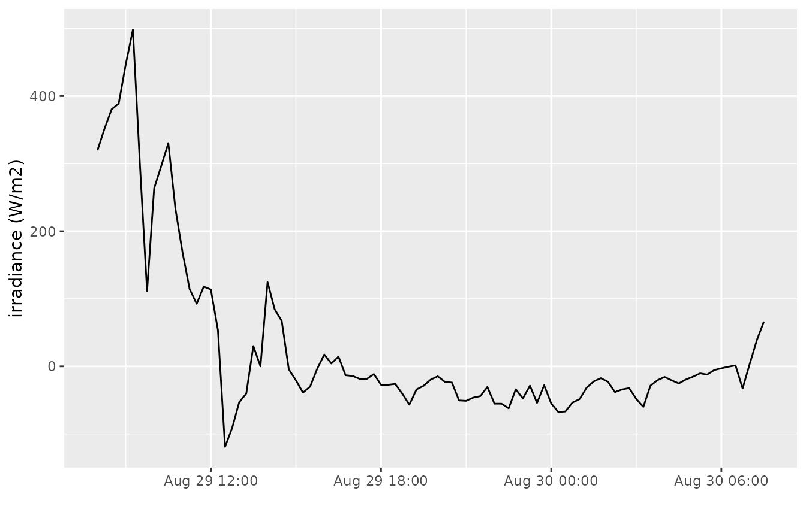
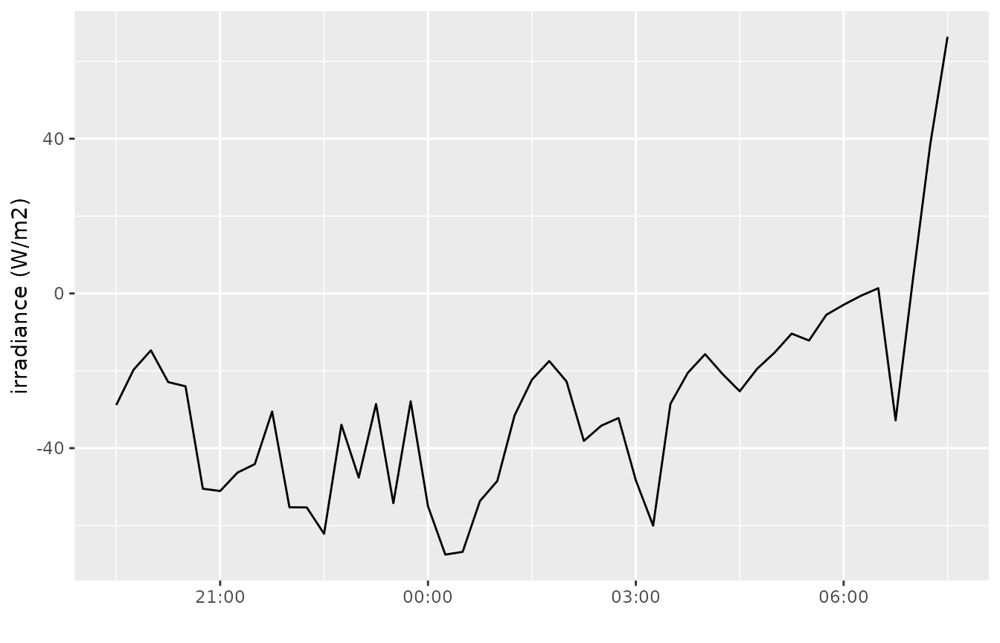
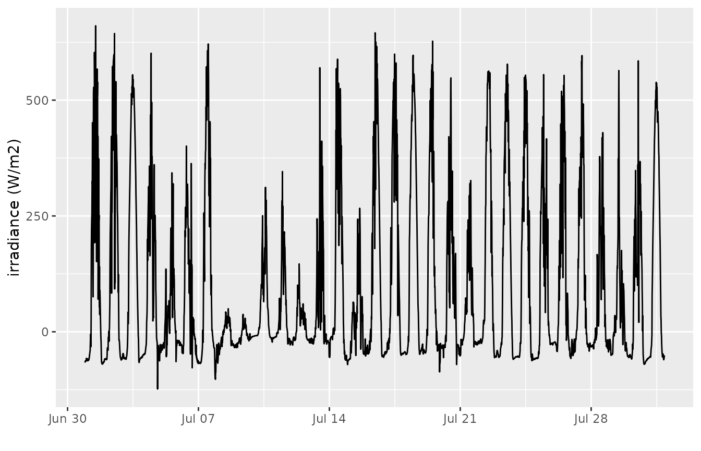
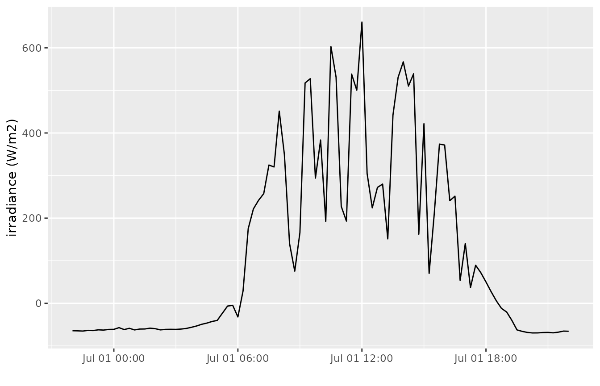

# Define the date period to download

## Introduction

When downloading time series with the
[`get_timeseries_tsid()`](https://docs.ropensci.org/wateRinfo/reference/get_timeseries_tsid.md)
method, the `ts_id` argument provides the link with the variable,
location and frequency of the time series, but not the extent/period to
download.

The time period to download is defined by a combination of the arguments
`from`, `to` and `period`. The usage is similar with the [VMM
documentation](https://www.waterinfo.be/download/9f5ee0c9-dafa-46de-958b-7cac46eb8c23?dl=0)
for the API itself. The main difference is that the `wateRinfo` package
uses existing R functions to interpret the date strings given by the
user before sending these to the API (as a formatted string according to
`%Y-%m-%d %H:%M:%S`).

This vignette aims to briefly explain how to define the arguments.

## Which combinations?

In order to define a period, a start and end date is required. Defining
all three will result in an error, but any combination of `from/to`,
`from/period` and `to/period` is allowed. Moreover, if only `period` or
`from` are defined, the waterinfo.be API will automatically define `to`
as the current time. Hence, defining *the last x days/months/years/…*
can be achieved by only using the `period` option.

## How to define the from/to dates

The package will both except valid date strings as well as valid date
objects (`POSIXct`, `POSIXt`) as input for the `from` and `to`
arguments. When using a string value, it can be defined on different
resolutions:

- “2017-01-01 11:00:00”
- “2017-01-01”
- “2017-01”
- “2017”

According to the [`lubridate`](https://lubridate.tidyverse.org/)
package, these orders are accepted: `ymd_hms`, `ymd`, `ym`, `y`. As a
result, also `"2017/01/01"`, `"2017 01 01"` or `"20170101"` are valid
date string inputs. Make sure the order of year-month-day is respected.
For example, `"01/01/2017"`, `"01-01-2017"` and `"01-2017"` are NOT
valid.

## How to define the period

The period string provides a flexible way to extract a time period
starting (in combination with `from`) or ending (in combination with
`to`) at a given moment. Moreover, by using only the `period` as
argument, it will cover all cases where one is interested in *the last x
days/months/years/…*.

Some examples are:

- `P3D` : period of three days
- `P2Y` : period of 2 years
- `PT6H` : period of 6 hours
- `P2DT6H` : period of 2 days and 6 hours
- …

In general, the period string should be provided as `P#Y#M#DT#H#M#S`,
where P defines `Period` (always required!) and each \# is an integer
value expressing *the number of…*. The codes define a specific time
interval:

- `Y` - years
- `M` - months
- `D` - days
- `W` - weeks
- `H` - hours
- `M` - minutes
- `S` - seconds

`T` is required if codes about sub-day resolution (day, minutes, hours)
is part of the period string. Furthermore, `D` and `W` are mutually
exclusive.

More examples of valid period strings are:

- `P1DT12H` : period of 1 day and 12 hours
- `P2WT12H` : period of 2 weeks and 12 hours
- `P1Y6M3DT4H20M30S`: period of 1 year, six months, 3 days, 4 hours, 20
  minutes and 30 seconds

## Examples

``` r

library(wateRinfo)
```

When interested in irradiance (15min frequency) data, the following
stations provide time series:

``` r

get_stations("irradiance")
```

    ##      ts_id station_latitude station_longitude station_id station_no
    ## 1 78845042         51.27226          3.728299      12207   ME03_017
    ## 2 78879042         50.86149          3.411318      12209   ME05_019
    ## 3 78947042         51.20300          5.439589      12213   ME11_002
    ## 4 78913042         50.73795          5.141976      12211   ME09_012
    ## 5 78862042         51.24379          4.266912      12208   ME04_001
    ## 6 78896042         50.88663          4.094898      12210   ME07_006
    ## 7 78930042         51.16224          4.845708      12212   ME10_011
    ##              station_name stationparameter_name parametertype_name
    ## 1            Boekhoute_ME                   Rad                 Rn
    ## 2              Waregem_ME                   Rad                 Rn
    ## 3             Overpelt_ME                   Rad                 Rn
    ## 4 Niel-bij-St.-Truiden_ME                   Rad                 Rn
    ## 5              Melsele_ME                   Rad                 Rn
    ## 6           Liedekerke_ME                   Rad                 Rn
    ## 7            Herentals_ME                   Rad                 Rn
    ##   ts_unitsymbol dataprovider
    ## 1          W/m²          VMM
    ## 2          W/m²          VMM
    ## 3          W/m²          VMM
    ## 4          W/m²          VMM
    ## 5          W/m²          VMM
    ## 6          W/m²          VMM
    ## 7          W/m²          VMM

Focusing on the data of Herentals, the `ts_id` to use is `78930042`. We
have different options to define the period to get data from:

1.  data about **the last day**, using `period` only:

``` r

irr_lastday <- get_timeseries_tsid("78930042", period = "P1D")
ggplot(irr_lastday, aes(Timestamp, Value)) +
    geom_line() + xlab("") + ylab("irradiance (W/m2)")
```



2.  data about **the last 12 hours, 30 minutes**, using `period` only:

``` r

irr_lasthours <- get_timeseries_tsid("78930042", period = "PT12H30M")
ggplot(irr_lasthours, aes(Timestamp, Value)) +
    geom_line() + xlab("") + ylab("irradiance (W/m2)")
```



3.  historical data **from July till August 2014**, using `from` and
    `to` on month level

``` r

irr_2014 <- get_timeseries_tsid("78930042", 
                                from = "2014-07-01", 
                                to = "2014-08-01")
ggplot(irr_2014, aes(Timestamp, Value)) +
    geom_line() + xlab("") + ylab("irradiance (W/m2)")
```



4.  historical data for **one day from July 1st 2014**, using `from` and
    `period`

``` r

irr_2014day <- get_timeseries_tsid("78930042", 
                                from = "2014-07-01", 
                                period = "P1D")
ggplot(irr_2014day, aes(Timestamp, Value)) +
    geom_line() + xlab("") + ylab("irradiance (W/m2)")
```


