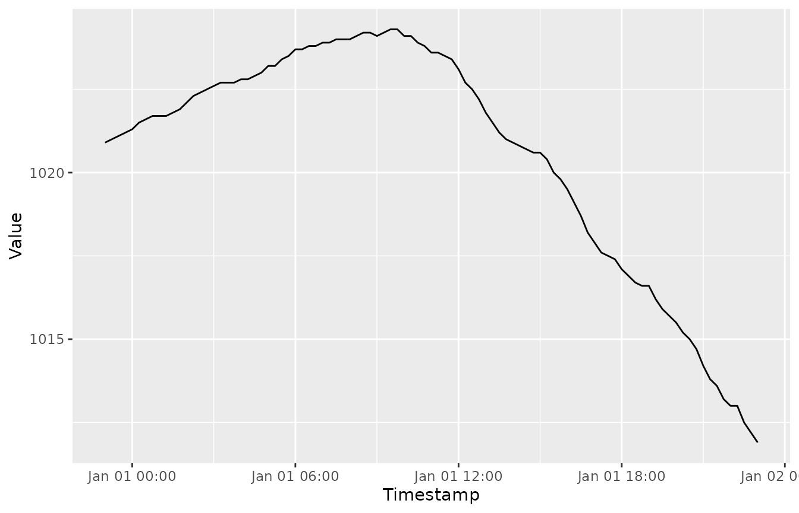
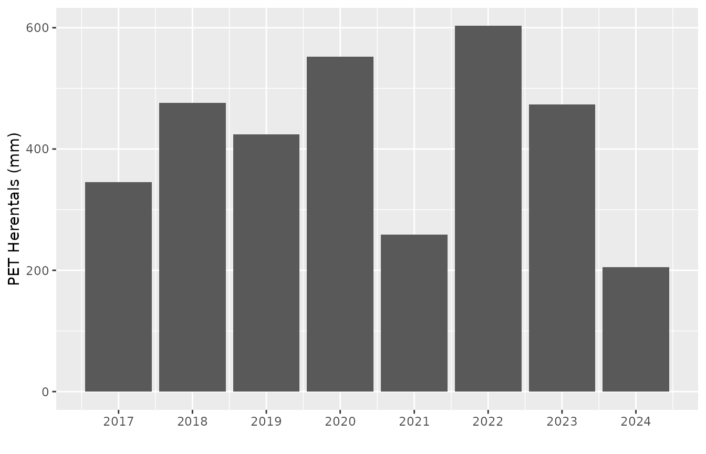
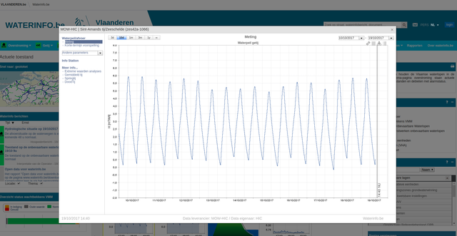
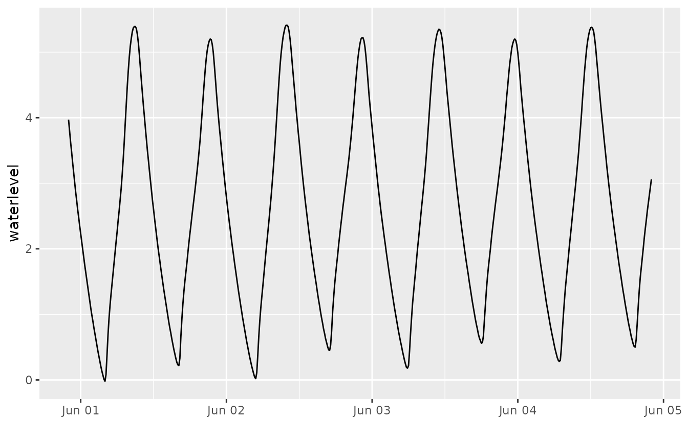
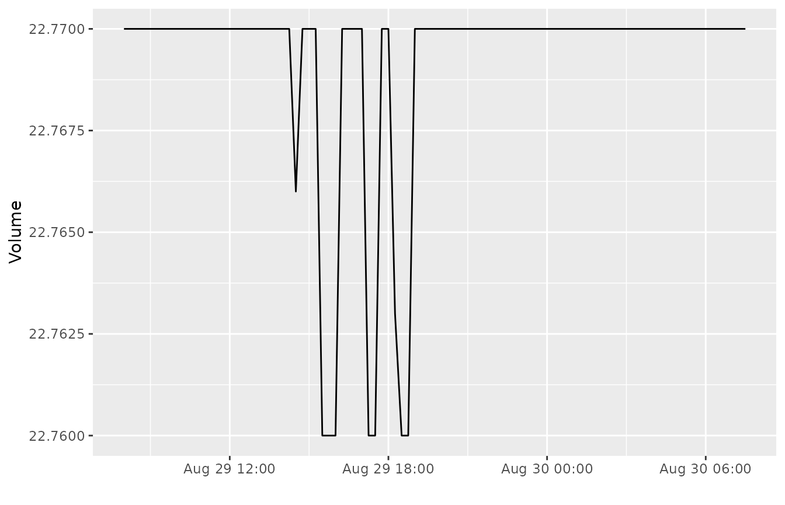
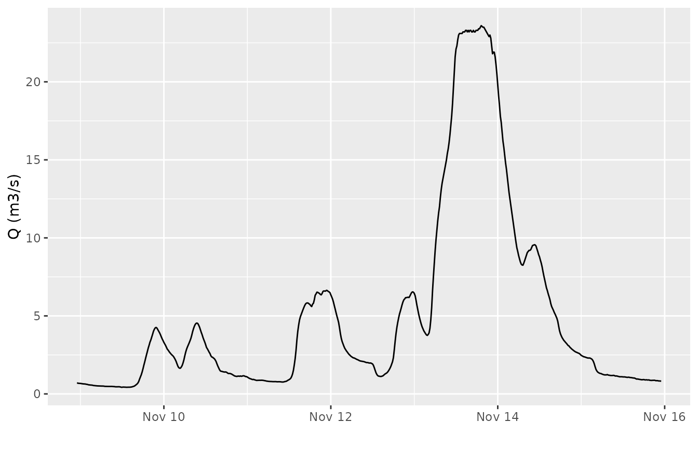

# Introduction to downloading time series data from waterinfo.be

## Introduction

The [waterinfo.be](https://www.waterinfo.be) API uses a system of
identifiers, called `ts_id` to define individual time series. For
example, the identifier `ts_id = 78073042` corresponds to the time
series of air pressure data for the measurement station in Liedekerke,
with a 15 min time resolution. Hence, the `ts_id` identifier defines a
variable of interest from a measurement station of interest with a
specific frequency (e.g. 15 min, hourly,…). The knowledge of the proper
identifier is essential to be able to download the corresponding data.

## Download with known `ts` identifier

In case you already know the `ts_id` identifier that defines your time
serie, the package provides the function
[`get_timeseries_tsid()`](https://docs.ropensci.org/wateRinfo/reference/get_timeseries_tsid.md)
to download a specific period of the time series.

As an example, to download the air pressure time series data of
Liedekerke with a 15 min resolution (`ts_id = 78073042`) for the first
of January 2016:

``` r

my_data <- get_timeseries_tsid("78073042", from = "2016-01-01", to = "2016-01-02")
knitr::kable(head(my_data), align = "lcc")
```

| Timestamp           | Value  | Quality Code |
|:--------------------|:------:|:------------:|
| 2015-12-31 23:00:00 | 1020.9 |     130      |
| 2015-12-31 23:15:00 | 1021.0 |     130      |
| 2015-12-31 23:30:00 | 1021.1 |     130      |
| 2015-12-31 23:45:00 | 1021.2 |     130      |
| 2016-01-01 00:00:00 | 1021.3 |     130      |
| 2016-01-01 00:15:00 | 1021.5 |     130      |

For more information on defining the date period of the download, see
[this
vignette](https://ropensci.github.io/wateRinfo/articles/define_date_periods.html).
Let’s have a visual check of our data, using the `ggplot2` package:

``` r

ggplot(my_data, aes(Timestamp, Value)) + 
    geom_line()
```



As such, knowing the identifier is the most straightforward way of
downloading a time series. In order to find these `ts_id` identifier,
the package supports looking for identifiers based on a supported
variable name (limited set of supported variables by VMM) or looking for
identifiers by checking all variables for an individual station. These
methods are explained in the next sections.

## Search identifier based on variable name

For a number of variables, the [documentation of the waterinfo.be
API](https://www.waterinfo.be/download/9f5ee0c9-dafa-46de-958b-7cac46eb8c23?dl=0)
provides a direct overview option of all available VMM measurement
stations, using the so-called `Timeseriesgroup_id`. For these variables,
the package provides the function
[`get_stations()`](https://docs.ropensci.org/wateRinfo/reference/get_stations.md)
to download an overview of available measurement stations and the
related `ts_id` identifiers. The latter can be used to [download the
time series](#download-with-known-ts-identifier).

``` r

get_stations("air_pressure")
```

    ##        ts_id station_latitude station_longitude station_id      station_no
    ## 1   78124042         51.20300          5.439589      12213        ME11_002
    ## 2   78005042         51.02263          2.970584      12206        ME01_003
    ## 3   78039042         51.24379          4.266912      12208        ME04_001
    ## 4   78107042         51.16224          4.845708      12212        ME10_011
    ## 5   78073042         50.88663          4.094898      12210        ME07_006
    ## 6  265106042         51.21839          3.232655     380308 HITTE_T4BB28001
    ## 7  264266042         50.92801          5.334829     379589 HITTE_T2HS11001
    ## 8   78022042         51.27226          3.728299      12207        ME03_017
    ## 9   78056042         50.86149          3.411318      12209        ME05_019
    ## 10  78090042         50.73795          5.141976      12211        ME09_012
    ## 11 258220042         51.13194          4.572651     369510 HITTE_T2LR03001
    ## 12 258290042         51.17392          4.611708     369524 HITTE_T2RN01001
    ##               station_name stationparameter_name parametertype_name
    ## 1              Overpelt_ME                    Pa                 Pa
    ## 2                Zarren_ME                    Pa                 Pa
    ## 3               Melsele_ME                    Pa                 Pa
    ## 4             Herentals_ME                    Pa                 Pa
    ## 5            Liedekerke_ME                    Pa                 Pa
    ## 6              Brugge_ALMC                    Pa                 Pa
    ## 7            Hasselt2_ALMC                    Pa                 Pa
    ## 8             Boekhoute_ME                    Pa                 Pa
    ## 9               Waregem_ME                    Pa                 Pa
    ## 10 Niel-bij-St.-Truiden_ME                    Pa                 Pa
    ## 11               Lier_ALMC                    Pa                 Pa
    ## 12              Ranst_ALMC                    Pa                 Pa
    ##    ts_unitsymbol dataprovider
    ## 1            hPa          VMM
    ## 2            hPa          VMM
    ## 3            hPa          VMM
    ## 4            hPa          VMM
    ## 5            hPa          VMM
    ## 6            hPa          VMM
    ## 7            hPa          VMM
    ## 8            hPa          VMM
    ## 9            hPa          VMM
    ## 10           hPa          VMM
    ## 11           hPa          VMM
    ## 12           hPa          VMM

By default, the expected frequency is the 15 min frequency of the time
series. However, for some of the variables, multiple frequencies are
supported by the API. The package provides a check on the supported
variables and frequencies. An overview of the currently supported
variables can be requested with the command
[`supported_variables()`](https://docs.ropensci.org/wateRinfo/reference/supported_variables.md)
(either in Dutch, `nl`, or in English, `en`). Actually, more variables
are available with the API (see next section), but for each of these
variables the
[`get_stations()`](https://docs.ropensci.org/wateRinfo/reference/get_stations.md)
function is supported (i.e. the `Timeseriesgroup_id` is documented by
VMM).

``` r

supported_variables("en") %>% 
    as.list()
```

    ## $variable_en
    ##  [1] "discharge"             "soil_saturation"       "soil_moisture"        
    ##  [4] "dew_point_temperature" "ground_temperature"    "ground_heat"          
    ##  [7] "irradiance"            "air_pressure"          "air_temperature_175cm"
    ## [10] "rainfall"              "relative_humidity"     "evaporation_monteith" 
    ## [13] "evaporation_penman"    "water_velocity"        "water_level"          
    ## [16] "water_temperature"     "wind_direction"        "wind_speed"

To check which predefined frequencies are provided by the waterinfo.be
API for a given variable, the
[`supported_frequencies()`](https://docs.ropensci.org/wateRinfo/reference/supported_frequencies.md)
function is available:

``` r

supported_frequencies(variable_name = "air_pressure")
```

    ## [1] "15min"

Hence, for air pressure data, only the 15 min resolution is supported.
Compared to evaporation derived by the [Monteith
equation](https://en.wikipedia.org/wiki/Penman%E2%80%93Monteith_equation):

``` r

supported_frequencies(variable_name = "evaporation_monteith")
```

    ## [1] "15min" "day"   "month" "year"

Multiple resolutions are available. Using the coarser time resolutions
can be helpful when you want to download longer time series while
keeping the number of records to download low (if the frequency would be
sufficient for your analysis):

``` r

stations <- get_stations("evaporation_monteith", frequency = "year")
subset_of_columns <- stations %>% select(ts_id, station_no, station_name, 
                                         parametertype_name, ts_unitsymbol)
knitr::kable(subset_of_columns)
```

|    ts_id | station_no | station_name            | parametertype_name | ts_unitsymbol |
|---------:|:-----------|:------------------------|:-------------------|:--------------|
| 94306042 | ME01_003   | Zarren_ME               | PET                | mm            |
| 94526042 | ME10_011   | Herentals_ME            | PET                | mm            |
| 94512042 | ME09_012   | Niel-bij-St.-Truiden_ME | PET                | mm            |
| 94540042 | ME11_002   | Overpelt_ME             | PET                | mm            |
| 94470042 | ME04_001   | Melsele_ME              | PET                | mm            |
| 94498042 | ME07_006   | Liedekerke_ME           | PET                | mm            |
| 94484042 | ME05_019   | Waregem_ME              | PET                | mm            |
| 94456042 | ME03_017   | Boekhoute_ME            | PET                | mm            |

When interested in the data of `Herentals_ME`, we can use the
corresponding `ts_id` to download the time series of PET with a yearly
frequency and make a plot with `ggplot`:

``` r

pet_yearly <- get_timeseries_tsid("94526042", period = "P10Y")
pet_yearly %>% 
    na.omit() %>%
    ggplot(aes(Timestamp, Value)) + 
    geom_bar(stat = "identity") +
    scale_x_datetime(date_labels = "%Y", date_breaks = "1 year") + 
    xlab("") + ylab("PET Herentals (mm)")
```



See [this
vignette](https://ropensci.github.io/wateRinfo/articles/define_date_periods.html)
to understand the `period = "P10Y"` format.

**Remark:** the
[`get_stations()`](https://docs.ropensci.org/wateRinfo/reference/get_stations.md)
function only works for those measurement stations belonging to the VMM
`meetnet` (network), related to the so-called `datasource = 1`. For
[other
networks](http://www.waterinfo.be/default.aspx?path=NL/HIC/Recent_toelichting),
i.e. `datasource = 4`, the enlisting is not supported. Still, a search
for data is provided starting from a given station name, as explained in
the next section.

## Search identifier based on station name

In addition to the option to check the measurement stations that can
provide data for a given variable, the package provides the function
[`get_variables()`](https://docs.ropensci.org/wateRinfo/reference/get_variables.md)
to get an overview of the available variables for a given station, using
the `station_no`. The advantage compared to the `ts_id` is that these
`station_no` names are provided by the waterinfo.be website itself when
exploring the data. When clicking on a measurement station on the map
and checking the time series graph, the `station_no` is provided in the
upper left corner in between brackets.



Waterinfo.be example printscreen of time series

So, for the example in the figure, i.e. `station_no = zes42a-1066`, the
available time series are retrieved by using the
[`get_variables()`](https://docs.ropensci.org/wateRinfo/reference/get_variables.md)
command:

``` r

available_variables <- get_variables("zes42a-1066")
```

    ## Use datasource: 4 for data requests of this station!

``` r

available_variables %>% select(ts_id, station_name, ts_name, 
                               parametertype_name)
```

    ##        ts_id               station_name              ts_name parametertype_name
    ## 1   55421010 Sint-Amands tij/Zeeschelde            HW.KD_NKD                  W
    ## 2   55429010 Sint-Amands tij/Zeeschelde                Pv.HW                  W
    ## 3   55435010 Sint-Amands tij/Zeeschelde              Pv.Lang                  W
    ## 4   55440010 Sint-Amands tij/Zeeschelde              HW.Hist                  W
    ## 5   55442010 Sint-Amands tij/Zeeschelde             Gaugings                  W
    ## 6   55446010 Sint-Amands tij/Zeeschelde         GaugingsDiff                  W
    ## 7   55449010 Sint-Amands tij/Zeeschelde               LW.tpk                  W
    ## 8  113485010 Sint-Amands tij/Zeeschelde         Astro.LW.tpk        W_voorspeld
    ## 9  113487010 Sint-Amands tij/Zeeschelde          Astro.Pv.LW        W_voorspeld
    ## 10  55414010 Sint-Amands tij/Zeeschelde           O.Gaugings                  W
    ## 11  55426010 Sint-Amands tij/Zeeschelde               Kidigi                  W
    ## 12  55432010 Sint-Amands tij/Zeeschelde          O.LW.KD_NKD                  W
    ## 13  55437010 Sint-Amands tij/Zeeschelde           Pv.LW.Lang                  W
    ## 14  55439010 Sint-Amands tij/Zeeschelde        O.HWLW.Kidigi                  W
    ## 15  55445010 Sint-Amands tij/Zeeschelde               LW.typ                  W
    ## 16  94251010 Sint-Amands tij/Zeeschelde        AlarmStatus.O                  W
    ## 17  88623010 Sint-Amands tij/Zeeschelde           Astro.HWLW        W_voorspeld
    ## 18 112686010 Sint-Amands tij/Zeeschelde             Astro.10        W_voorspeld
    ## 19  55418010 Sint-Amands tij/Zeeschelde                HW.KK                  W
    ## 20  55433010 Sint-Amands tij/Zeeschelde                Model                  W
    ## 21  55438010 Sint-Amands tij/Zeeschelde           HW.t-h.wdw                  W
    ## 22  55441010 Sint-Amands tij/Zeeschelde            LW.KD_NKD                  W
    ## 23  58546010 Sint-Amands tij/Zeeschelde              LW.hulp                  W
    ## 24 113486010 Sint-Amands tij/Zeeschelde          Astro.Pv.HW        W_voorspeld
    ## 25  55416010 Sint-Amands tij/Zeeschelde                O.01b                  W
    ## 26  55434010 Sint-Amands tij/Zeeschelde          HWLW.Kidigi                  W
    ## 27  55447010 Sint-Amands tij/Zeeschelde                LW.KK                  W
    ## 28  55423010 Sint-Amands tij/Zeeschelde        GaugingsGDiff                  W
    ## 29  55425010 Sint-Amands tij/Zeeschelde              Pv.HWLW                  W
    ## 30  55428010 Sint-Amands tij/Zeeschelde        O.TerrainCorr                  W
    ## 31  55448010 Sint-Amands tij/Zeeschelde                   Pv                  W
    ## 32 113484010 Sint-Amands tij/Zeeschelde         Astro.HW.tpk        W_voorspeld
    ## 33 133445010 Sint-Amands tij/Zeeschelde  HIC-ECMWF-2DNevla.O        W_voorspeld
    ## 34  55415010 Sint-Amands tij/Zeeschelde                   RC                  W
    ## 35  55427010 Sint-Amands tij/Zeeschelde              LW.Hist                  W
    ## 36  55430010 Sint-Amands tij/Zeeschelde                Pv.LW                  W
    ## 37  55436010 Sint-Amands tij/Zeeschelde           Pv.HW.Lang                  W
    ## 38 112685010 Sint-Amands tij/Zeeschelde             Astro.05        W_voorspeld
    ## 39  55424010 Sint-Amands tij/Zeeschelde                Pv.05                  W
    ## 40  55431010 Sint-Amands tij/Zeeschelde            Base.Lang                  W
    ## 41  84309010 Sint-Amands tij/Zeeschelde      KT-Percentile.O        W_voorspeld
    ## 42  96961010 Sint-Amands tij/Zeeschelde                KT-HW        W_voorspeld
    ## 43  96962010 Sint-Amands tij/Zeeschelde                KT-LW        W_voorspeld
    ## 44  99870010 Sint-Amands tij/Zeeschelde KT-AlarmStatus-Max.O        W_voorspeld
    ## 45 113488010 Sint-Amands tij/Zeeschelde        Astro.Pv.HWLW        W_voorspeld
    ## 46  55417010 Sint-Amands tij/Zeeschelde                 Base                  W
    ## 47  55419010 Sint-Amands tij/Zeeschelde                Pv.10                  W
    ## 48  55420010 Sint-Amands tij/Zeeschelde               HW.tpk                  W
    ## 49  55422010 Sint-Amands tij/Zeeschelde               HW.typ                  W
    ## 50  55443010 Sint-Amands tij/Zeeschelde               LW.rco                  W
    ## 51  55444010 Sint-Amands tij/Zeeschelde           LW.t-h.wdw                  W
    ## 52  55450010 Sint-Amands tij/Zeeschelde          O.HW.KD_NKD                  W
    ## 53  88620010 Sint-Amands tij/Zeeschelde             Astro.01        W_voorspeld
    ## 54  89205010 Sint-Amands tij/Zeeschelde             KT-det.O        W_voorspeld
    ## 55  96864010 Sint-Amands tij/Zeeschelde              KT-Last        W_voorspeld

The available number of variables depends on the measurement station.
The representation is not standardized and also depends on the type of
[`meetnet`](http://www.waterinfo.be/default.aspx?path=NL/HIC/Recent_toelichting).
Nevertheless, one can derive the required `ts_id` from the list when
interpreting the field names. Remark that the datasource can be 4
instead of 1 for specific `meetnetten` (networks). The datasource to use
is printed when asking the variables for a station.

In order to download the 10 min time series water level data for the
station in Sint-Amands tij/Zeeschelde, the `ts_id = 55419010` can be
used in the
[`get_timeseries_tsid()`](https://docs.ropensci.org/wateRinfo/reference/get_timeseries_tsid.md)
function, taking into account the `datasource = 4` (default is 1):

``` r

tide_stamands <- get_timeseries_tsid("55419010", 
                                     from = "2017-06-01", to = "2017-06-05",
                                     datasource = 4)
ggplot(tide_stamands, aes(Timestamp, Value)) + 
    geom_line() + xlab("") + ylab("waterlevel")
```



For some measurement stations, the number of variables can be high (lots
of precalculated derivative values) and extracting the required time
series identifier is not always straightforward. For example, the dat
Etikhove/Schuif/Nederaalbeek (`K06_221`), provides the following number
of variables:

``` r

available_variables <- get_variables("K06_221")
```

    ## Use datasource: 1 for data requests of this station!

``` r

nrow(available_variables)
```

    ## [1] 109

As the measured variables at a small time resolution are of most
interest, filtering on `P.15` (or `P.1`, `P.60`,…) will help to identify
measured time series, for those stations belonging to the `meetnet` of
VMM (`datasource = 1`):

``` r

available_variables <- get_variables("K06_221")
```

    ## Use datasource: 1 for data requests of this station!

``` r

available_variables %>% 
    filter(ts_name == "P.15")
```

    ##                   station_name station_no    ts_id ts_name parametertype_name
    ## 1 Etikhove/Schuif/Nederaalbeek    K06_221 22322042    P.15                  H
    ## 2 Etikhove/Schuif/Nederaalbeek    K06_221 31882042    P.15                 Hk
    ## 3 Etikhove/Schuif/Nederaalbeek    K06_221 29156042    P.15                  H
    ## 4 Etikhove/Schuif/Nederaalbeek    K06_221 22302042    P.15                  H
    ## 5 Etikhove/Schuif/Nederaalbeek    K06_221 84094042    P.15 Volume Wachtbekken
    ##   stationparameter_name
    ## 1                  Hopw
    ## 2               Hschuif
    ## 3    Hafw 100m afwaarts
    ## 4                Hafw  
    ## 5    Volume_wachtbekken

Loading and visualizing the last day (period `P1D`) of available data
for the water level downstream (`Hafw`):

``` r

afw_etikhove <- get_timeseries_tsid("22302042", 
                                    period = "P1D",
                                    datasource = 1) # 1 is default

ggplot(afw_etikhove, aes(Timestamp, Value)) + 
    geom_line() + xlab("") + ylab("Volume")
```



We can do similar filtering to check for time series on other stations,
for example the Molenbeek in Etikhove:

``` r

available_variables <- get_variables("L06_347")
```

    ## Use datasource: 1 for data requests of this station!

``` r

available_variables %>%
    filter(ts_name == "P.15")
```

    ##         station_name station_no     ts_id ts_name parametertype_name
    ## 1 Etikhove/Molenbeek    L06_347 276546042    P.15                  v
    ## 2 Etikhove/Molenbeek    L06_347 276494042    P.15                  Q
    ## 3 Etikhove/Molenbeek    L06_347 276277042    P.15                  H
    ##   stationparameter_name
    ## 1                     v
    ## 2                     Q
    ## 3                     H

And use the `ts_id` code representing discharge to create a plot of the
discharge during a storm in 2010:

``` r

etikhove <- get_timeseries_tsid("276494042", 
                                from = "2010-11-09", to = "2010-11-16")

ggplot(etikhove, aes(Timestamp, Value)) + 
    geom_line() + xlab("") + ylab("Q (m3/s)")
```



## Check the URL used to request the data

As each of these data requests is actually a call to the
[waterinfo.be](https://www.waterinfo.be/) API, the call can be tested in
a browser as well. To retrieve the URL used to request certain data
(using
[`get_variables()`](https://docs.ropensci.org/wateRinfo/reference/get_variables.md),
[`get_stations()`](https://docs.ropensci.org/wateRinfo/reference/get_stations.md)
or
[`get_timeseries_tsid()`](https://docs.ropensci.org/wateRinfo/reference/get_timeseries_tsid.md)),
check the [`comment()`](https://rdrr.io/r/base/comment.html) attribute
of the returned `data.frame`, for example:

``` r

air_stations <- get_stations("air_pressure")
comment(air_stations)
```

    ## [1] "https://download.waterinfo.be/tsmdownload/KiWIS/KiWIS?type=queryServices&service=kisters&request=getTimeseriesValueLayer&datasource=1&timeseriesgroup_id=192918&format=json&metadata=TRUE&md_returnfields=custom_attributes%2Cstation_id%2Cstation_no%2Cstation_name%2Cstationparameter_name%2Cts_unitsymbol%2Cparametertype_name%2Cts_id%2Cca_sta&ca_sta_returnfields=dataprovider"

or

``` r

etikhove <- get_timeseries_tsid("276494042", 
                                from = "2010-11-09", to = "2010-11-16")
comment(etikhove)
```

    ## [1] "https://download.waterinfo.be/tsmdownload/KiWIS/KiWIS?type=queryServices&service=kisters&request=getTimeseriesvalues&ts_id=276494042&format=json&datasource=1&returnfields=Timestamp%2CValue%2CQuality%20Code&from=2010-11-09%2000%3A00%3A00&to=2010-11-16%2000%3A00%3A00"
